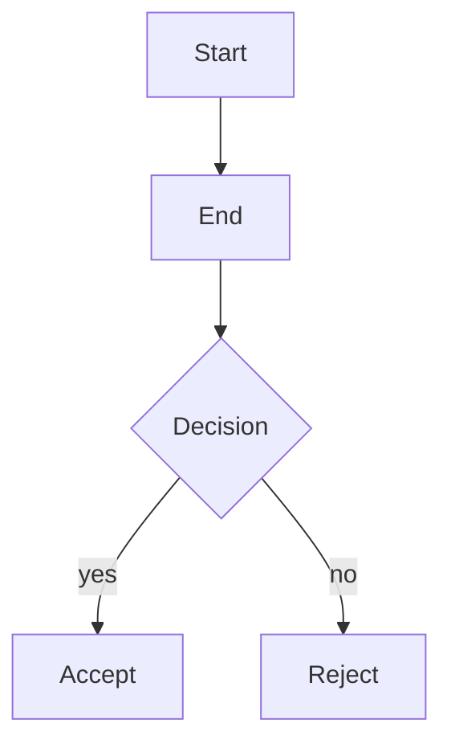
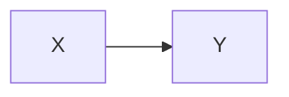

## Template literal props



## Code with special characters

**compare.py**

```python
def compare(a, b):
  if a > b:
      return "a is greater"
  return \`result: ${a}\`

```

## Nested components

> **Important note**
> This callout contains a [cited source](https://example.com) inline.

## Learning components

**Learning Objectives**

- Understand export pipeline.
- Verify golden-file tests.

**Prerequisites**

- Node.js installed
- Basic MDX knowledge

**Key Terms**

- **AST**: Abstract Syntax Tree
- **MDX**: Markdown with JSX

## Verification states

> **[VERIFY]** This claim needs source review.

> **Warning:** Do not skip validation.

## Interactive elements

**Flashcards**

- **Q:** What is MDX?
  **A:** Markdown with JSX components.

**Worked Example: Parse MDX**

1. Read the file.
2. Parse with remark-mdx.
3. Walk the AST.

AST-based transformation is more reliable than regex.

**Exercise: Write a transformer**

How would you convert an MDX component to plain Markdown?

<details><summary>Answer</summary>

Use the visitor pattern to handle each node type.

</details>

**Quiz Question 1:** Which parser handles MDX?

- [ ] remark-mdx
- [ ] marked
- [ ] showdown

<details><summary>Answer</summary>

remark-mdx extends remark-parse with JSX support.

</details>

## Standard markdown

Regular **bold** and *italic* text with `inline code`.

> A blockquote with
> multiple lines.

| Column A | Column B |
|----------|----------|
| Value 1  | Value 2  |

## Unknown component

<!-- EXPORT: unsupported component <CustomWidget> -->

## Diagram with fallback



> X connects to Y.

*Simple flow.*
